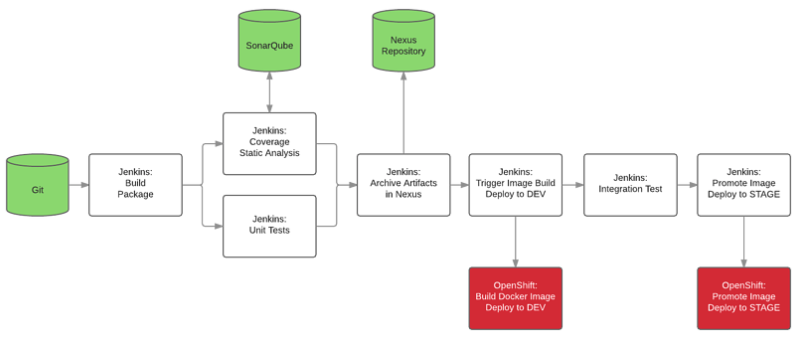

# Lab 2 - Run Sonar Scanner with Tekton



Steps:

1. Install `OpenShift Pipelines`,
2. Create Pipeline to Deploy NodeGoat
3. Run Pipeline
4. Test NodeGoat
5. Add Sonar Scan
6. Run Pipeline again
7. Review Scan

## 1. Install OpenShift Pipelines

1. Open the OpenShift Web Console,
1. Install `OpenShift Pipelines Operator` on OpenShift

Copy Login Command
Display Token
Copy the full `oc login` command,

```
oc login --token=lDpjhNl13ku2S6wlrnDfWw_ThMdYQ6qDSyyxqZKJLEA --server=https://c106-e.us-south.containers.cloud.ibm.com:32401
```

Create a new project,

```
oc new-project ns-my-nodegoat
```

Create a Route to access the OpenShift registry, if you have not done so already.

```
oc patch configs.imageregistry.operator.openshift.io/cluster --patch '{"spec":{"defaultRoute":true}}' --type=merge
```

To make sure the pipeline has the appropriate permissions to store images in the local OpenShift registry, you need to create a service account called `sa-pipeline`.

```
oc create serviceaccount sa-pipeline
oc adm policy add-scc-to-user privileged -z sa-pipeline
oc adm policy add-role-to-user edit -z sa-pipeline
oc policy add-role-to-user edit system:serviceaccount:ns-my-nodegoat:sa-pipeline -n ns-my-nodegoat
```

The Pipeline needs to deploy the NodeGoat App using Source-to-Image (S2I). One of the ways to deploy the NodeGoat app to OpenShift is using the `Source-to-Image (S2I)` strategy.

```
% oc new-app registry.access.redhat.com/ubi8/nodejs-10~https://github.com/remkohdev/NodeGoat --strategy=source --allow-missing-images --name=nodegoat -e PORT=8080

% oc get pods
NAME                READY   STATUS      RESTARTS   AGE
nodegoat-1-build    0/1     Completed   0          8m53s
nodegoat-1-deploy   0/1     Completed   0          4m31s
nodegoat-1-xlvfh    1/1     Running     0          4m29s

% oc port-forward nodegoat-1-xlvfh 8080:8080
```

Expose the service with a route,

```
% oc expose svc/nodegoat 
route.route.openshift.io/nodegoat exposed

% HOST=$(oc get routes nodegoat -o json | jq -r '.spec.host')
% open http://$HOST
```

## 2. Create Pipeline to Deploy NodeGoat

